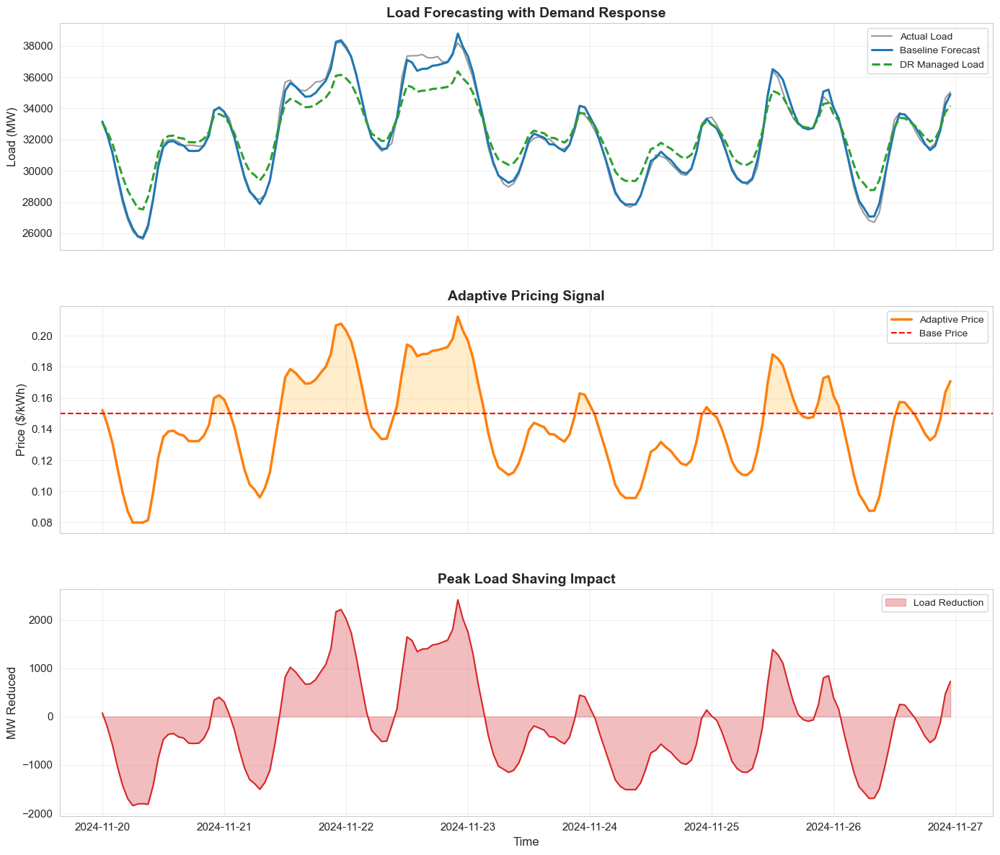
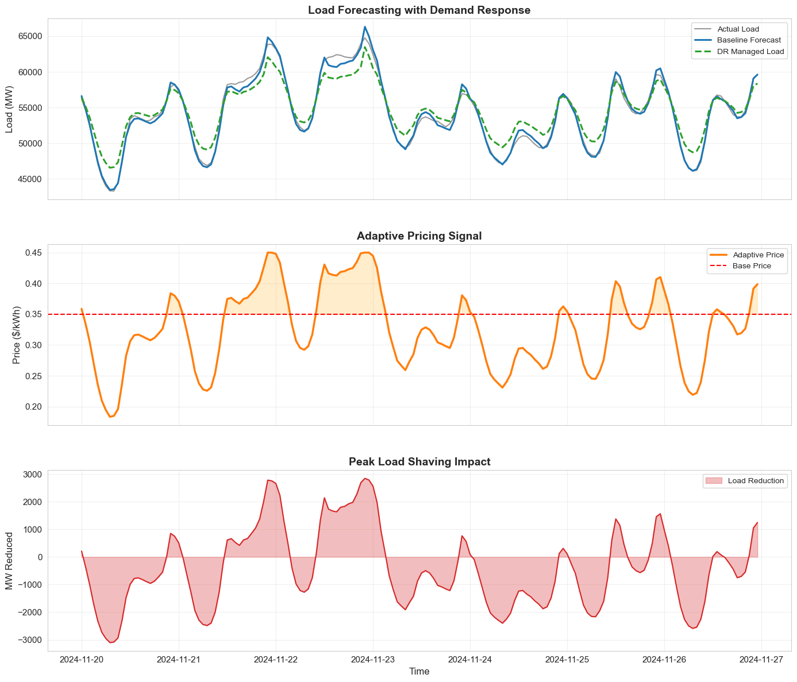
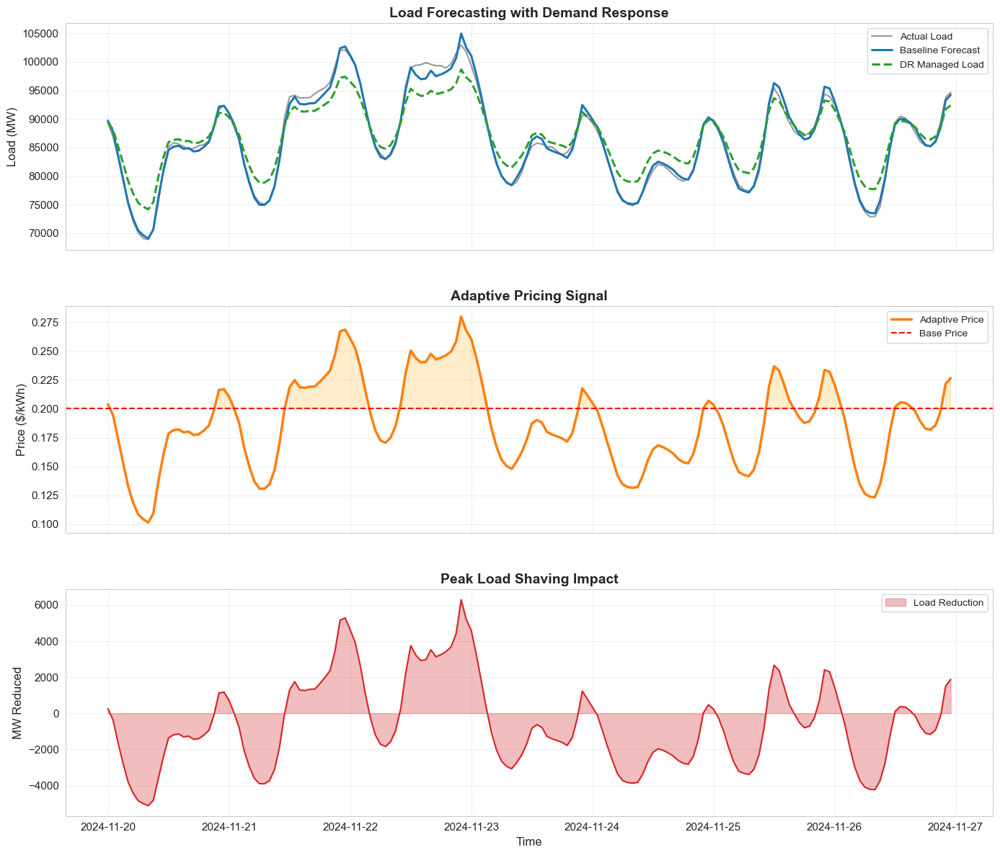

# Adaptive-Pricing-Optimization and Customer Segmentation
> A Data-Driven Smart Grid Framework for Energy Forecasting and Demand Response

[](https://www.python.org/)
[](https://www.tensorflow.org/)
[](https://jupyter.org/)
[](https://scikit-learn.org/)
[](https://opensource.org/licenses/MIT)


## Overview 
This repository contains the implementation of a smart grid framework designed to analyze, forecast, and optimize electricity consumption. By leveraging transformer-level energy data across distinct sectors, the system applies machine learning and deep learning to transition energy planning from intution-based to data-driven.

**Core Objectives** 
* **Identity & Segment:** Cluster transformers into meaningful sectors (Residential, Commercial, Industrial) based on consumption patterns.
* **Forecast:** Predict future energy demand with high accuracy using advanced hybrid modeling.
* **Optimize:** Design adaptive pricing strategies (Time-of-Use and Peak Pricing)

## Key Features 

### Data Processing & Feature Engineering 
* Handles multi-source datasets representing Residential, Commercial, and Industrial loads.
* Robust cleaning and preprocessing pipeline for hourly consumption data.
* Advanced feature engineering including lag features and rolling statistics.

### Transformer Segmentation (Clustering)
Automated segmentation using statistical load profiling:
* **Metrics Analyzed:** Load Factor, Peak-to-average ratio, Coefficient of Variation (CV).
* **Cluster Identified:** Residential | Commercial | Industrial

### Predictive Modeling 
A comprehensive suite of forecasting models, evaluated using standard metrics (MAE, MSE, RMSE).

* **Statistical:** ARIMA, Prophet
* **Machine Learning:** Random Forest, XGBoost
* **Deep Learning:** LSTM, GRU, BiLSTM
* **Advanced Hybrid:** CNN + BiLSTM + Attention Mechanism

### Adaptive Pricing & Demand Response 
* Generated cluster-specific electricity tariffs based on load profiles.
* Detected peak deamnd periods dynamically
* Simulated demand reduction using price elasticity under Time-of-Use (ToU) and peak pricing strategies.

## Project Structure
```text
├── Residential_data/
├── Commercial_data/
├── Industrial_data/
├── charts # Different charts of analysis 
├── Models # Each of the trained model for different segment
├── Transformer # figure for analysis of each transformer
├── EDA.ipynb    # Data exploration and cleaning
├── preprocessing.ipynb  # Transformer segmentation logic
├── Model_Train.ipynb       # ML/DL model training and evaluation and Tariff generation and demand response
├── results/                              # Forecast plots, pricing curves
├── requirements.txt                      # Project dependencies
└── README.md

```
## ⚙️ Getting Started 

**Prerequisites**
* Python 3.8+
* Jupyter Notebook or JupyterLab
* Google Colab (T4 GPU) or local CUDA-enabled environement recommended for training the CNN + BiLSTM hybrid model.

**Installation**
1. Clone the repository:

```bash
git clone [https://github.com/rohitr_iitp/adaptive-pricing-optimization.git](https://github.com/rohitr_iitp/adaptive-pricing-optimization.git)

cd adaptive-pricing-optimization
```

2. Install the required dependencies:

```bash
pip install -r requirements.txt
```

### Usage 

This project is built using Jupyter Notebooks to allow for step-by-step execution and data visualization.

1. Launch Jupyter Notebook from your terminal:

jupyter notebook

2. For the full pipeline, run the notebooks in sequential order:
* EDA.ipynb
* preprocessing.ipynb
* Model_Train.ipynb

**Adaptive Pricing Curves**

**Residential**

**Commercial**

**Industrial**



## Key Findings & Insights 

* **Load Stability:** Industrial loads exhibits high-volume but stable consumption, whereas residential loads demonstrate high peak variability.
* **Scalibility:** Cluster-based pricing strategies prove significantly more scalable for grid management than per-transformer micro-pricing.
* **Model Efficiancey:** Traditional ML Based Algorithms outperfroms some of the Deep Learning Architectures like Simple Transfromer and LSTMs.

## Future Scope 

* Dynamic Pricing : Integrating Reinforcement Learning for real-time tariff adjustments.
* Streaming Data: Adapting the pipeline for real-time ingestion via Kafka or similar event-streaming platforms.
* Grid Health : Adding transformer-level anomaly detection for predictive maintenance.

## Contributing 
Contributions, issues, and feature requests are welcome! Feel free to check the issues page.

## License 
This project is for academic and research purposes . Distributed under the MIT License. See LICENSE for more information.


